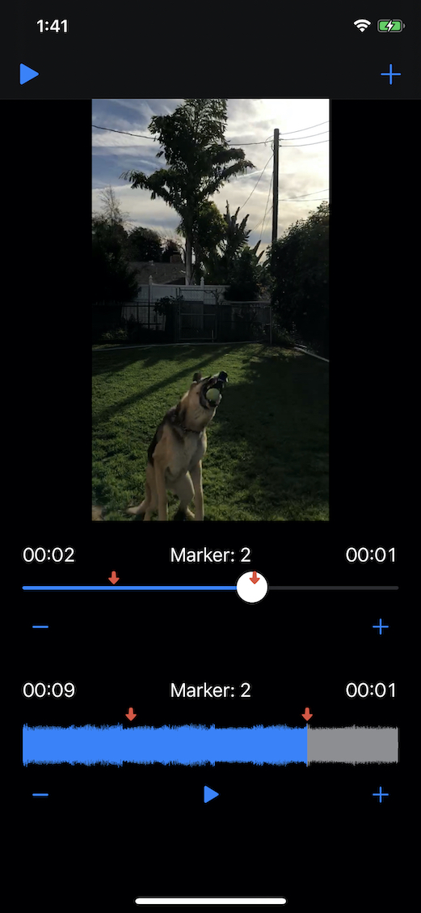

# iOS Demo Day

## Requirements

1. Fork and clone the repository
2. **Add your presentation content**
    1. Slide deck (4 required slides)
    2. Links
    3. Answer all questions 
    4. YouTube demo video (1-2 min max)
3. Polish your Github Code repository
    1. Add screenshots and an overview to your GitHub Code Repository
    2. You should make that repository the "Public Portfolio" for your project
    3. Look at [John Sundell's Splash project](https://github.com/JohnSundell/Splash) for inspiration (code, images, GIFs)
4. Create a pull request (PR) and **tag your TL and Instructor**

## Links

* Github Code: https://github.com/GiPyoK/rubato/tree/master
* Github Proposal: https://github.com/GiPyoK/ios-build-sprint-project-proposal
* Trello/Github Project Kanban: https://github.com/GiPyoK/rubato/projects/1
* Test Flight Signup (Recommended): https://testflight.apple.com/join/ogUB21sm
* YouTube demo video (Recommended): `<insert video url here>`

## Hero Image

## Questions (Answer indented below)

1. What was your favorite feature to implement? Why?

Applying slow motion effect to a video. That is what this app is for, and it is simply fun.

2. What was your #1 obstacle or bug that you fixed? How did you fix it?

Applying the slow-mo or the fast-mo gradually was the hardest part. There were a lot of calculations and cases to concider. Made exception to calculations for when the video duration for the slow/fast-mo is longer than the final duration and for when the video duration for the slow/fast-mo is shorter than the final duration.
  
3. Share a chunk of code (or file) you're proud of and explain why.

    `@IBAction func addVideoMarker(_ sender: Any) {
        let markerPosition = videoSlider.value / videoSlider.maximumValue
        guard let marker = Marker(position: Float64(markerPosition)) else { return }
        videoMarkers.append(marker)
        
        let imageView = UIImageView(image: marker.image)
        let size = videoMarkerView.frame.height
        let xPosition = (videoMarkerView.frame.width * CGFloat(markerPosition)) - size/2.0
        
        imageView.frame = CGRect(x: xPosition, y: 0, width: size, height: size)
        imageView.tag = videoMarkers.count
        videoMarkerView.addSubview(imageView)
        videoMarkerView.bringSubviewToFront(imageView)
        videoMarkerCount.text = "Marker: \(videoMarkers.count)"
    }
    
    @IBAction func removeVideoMarker(_ sender: Any) {
        if !videoMarkers.isEmpty {
            videoMarkerView.viewWithTag(videoMarkers.count)?.removeFromSuperview()
            videoMarkers.removeLast()
            videoMarkerCount.text = "Marker: \(videoMarkers.count)"
        }
    }`
    
    Adding and removing marker on a timeline without using an API was a fun challenge.
  
4. What is your elevator pitch? (30 second description your Grandma or a 5-year old would understand)

We are living in a world where we can save and share our memories with video, and rubato is an app to add more fun to it. With rubato, you can apply multiple slow motion effects to your video. You can also sync up the slow-motion to your favorite music’s beats.
  
5. What is your #1 feature?

Applying gradual slow-mo and fast-mo to a video.
  
6. What are you future goals?

Sync the slow/fast mo effect so that it matches the duration of the audio.
Able to import multiple videos.
Mix audio and video
Export the rendered video to photos app
Directly share the rendered video to social media apps

## Required Slides (Add your Keynote to your PR)

1. App Name / Team Slide
2. Elevator Pitch
3. Your #1 Feature (Customer facing — what can I do with your app?)
4. Future Goals

## Slide Requirements

1. 50 pt font minimum
2. Be concise — don't write sentences/paragraphs (put these in your slide notes for speaking)
3. 3-6 bullets maximum per slide
4. Do the squint test (can you read the text if you squint, if so, make the font bigger)
6. Images are always welcome
7. Do the Grandma Test (Would your Grandma understand you?)

### Optional Slides

1. Blooper: What's a funny bug or blooper? (screenshots/GIFs please)
2. Revenue Model: If the app was your sole source of income, how would you monetize it?

## Presentation Format

**7 minutes/team**

* 4 minute presentation (5 minute hard cap)
* 3 minutes of questions

We have ~12 teams presenting today — please practice your presentation with a timer (as a team), and make sure you fit within the time limit.

Plan on having one person present the slides and live demo. Please practice your presentation in front of a mirror or with your team 2-5 times. Have the app running and visible (Simulator or QuickTime) so you can quickly transition between slides and live demo.

* App Name / Team Slide (30 seconds)
* Elevator Pitch Slide (30 seconds)
* Your #1 Feature (30 seconds)
* Live Demo (2 minutes)
* Future Goals (30 seconds)
* Questions (3 minutes)
